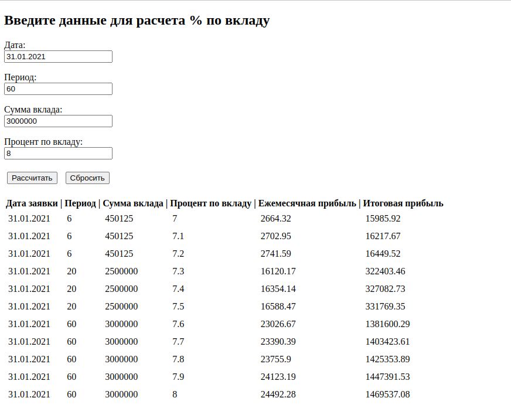

# Калькулятор банковских вкладов

### **Описание**
API сервис помесячно рассчитывает банковский вклад нарастающим эффектом. Пользователю доступен 
ввод информации через удобный интерфейс; вывод осуществляется в табличной форме по порядку 
завершенных рассчетов. Информация по вкладам записывается в базу данных для дальнейшего анализа;
например, какие запросы наиболее популярны для определенного периода времени. 

Принимает параметры:
* дата заявки
* срок размещения вклада в месяцах
* сумма вклада
* годовой процент по вкладу

### **Технологии**
* python 3.8
* fastapi 0.89.1
* starlette 0.22.0
* pydantic 1.10.4
* python-dateutil 2.8.2
* uvicorn 0.20.0

### **Быстрый запуск проекта через образ на DockerHub**
* _Перед запуском у вас должен быть установлен [Docker](https://docs.docker.com/engine/install/ubuntu/)_

Клонировать образ проекта с DockerHub
```
sudo docker pull boginskiy/calculate_deposit:v1.2
```

Запустить контейнер с образом
```
sudo docker run -d --name <имя_контейнера> -p 8000:8000 boginskiy/calculate_deposit:v1.2
```

### **Запуск проекта через Dockerfile**
Клонировать проект c GitHub
```
git clone git@github.com:boginskiy/calculate_deposit.git
```

Собрать образ проекта. Команда выполняется с корневой директории.
```
sudo docker build -t <имя_проекта> .
```

Запустить контейнер с образом
```
sudo docker run -d --name <имя_контейнера> -p 8000:8000 <имя_проекта>
```

### **Запуск проекта в dev режиме на Linux**
Клонировать проект c GitHub
```
git clone git@github.com:boginskiy/calculate_deposit.git
```
Установить виртуальное окружение venv
```
python3 -m venv venv
```
Активировать виртуальное окружение venv
```
source venv/bin/activate
```
Обновить менеджер пакетов pip
```
python3 -m pip install --upgrade pip
```
Установить зависимости из файла requirements.txt
```
pip install -r requirements.txt
``` 
Запуск
```
uvicorn main:app --reload
```

### **Пользовательский интерфейс**



### **Примеры запросов и ответов API**
#### **Калькулятор приложения:**
Отправка данных для расчета вклада. (POST): `http://127.0.0.1:8000/calculate`

```
request body

    {
      "date": "31.01.2021",
      "periods": 7,
      "amount": 10000,
      "rate": 6
    }
```

* _date - дата заявки, формат "31.12.2023"_
* _periods - количество месяцев по вкладу, от 1 до 60_
* _amount - первоначальная сумма вклада, от 10.000 до 3.000.000_
* _rate - процент по вкладу, от 1 до 8_

```
response body

    {
      "31.01.2021": 10050,
      "28.02.2021": 10100.25,
      "31.03.2021": 10150.75,
      "30.04.2021": 10201.5,
      "31.05.2021": 10252.51,
      "30.06.2021": 10303.77,
      "31.07.2021": 10355.29
    }
```
---

### **Автор**
[Богинский Дмитрий](https://github.com/boginskiy) - python разработчик